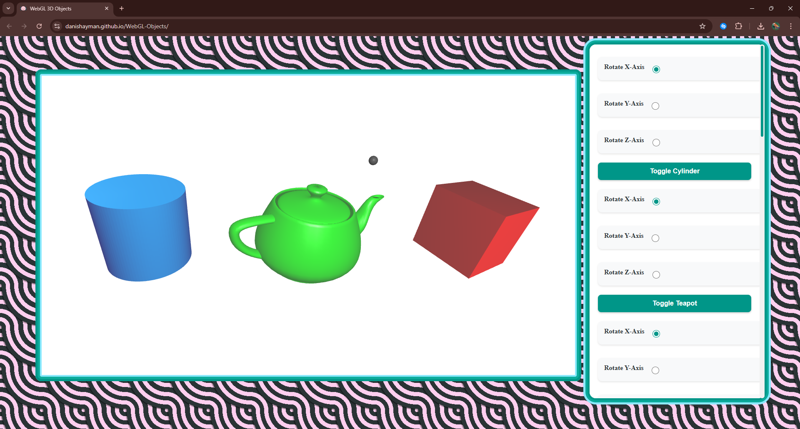

# 3D Graphics Rendering Engine 🎮


This project implements a WebGL-based 3D graphics rendering engine with support for multiple geometric shapes, dynamic lighting, material properties, and camera controls. ✨

## 🚀 Try It Yourself

Experience the 3D Graphics Rendering Engine in action: [Live Demo](https://danishayman.github.io/WebGL-Objects/)

## ✨ Features

### 🎨 Geometric Shapes
- Cylinder with customizable dimensions and caps
- Utah Teapot with adjustable tessellation
- Cube with texturable surfaces
- Light source visualization using a sphere

### 🔄 Animation Controls
- Independent rotation controls for each shape
- Axis selection (X, Y, Z) for rotation
- Toggle animation for each object
- Smooth animation rendering at 60fps

### 💡 Lighting System
- Configurable light types:
  - Point light
  - Directional light
  - Spotlight with adjustable parameters
- Light source properties:
  - Ambient, diffuse, and specular components
  - Adjustable color and intensity
  - Positional control in 3D space
- Spotlight features:
  - Adjustable cutoff angle
  - Configurable direction
  - Intensity control

### 🎯 Material Properties
- Per-object material settings:
  - Ambient, diffuse, and specular colors
  - Reflection coefficients
  - Shininess control
- Real-time material updates
- Independent material settings for each object

### 📷 Camera System
- Interactive camera controls:
  - Adjustable eye position (camera location)
  - Look-at point configuration
  - Up vector manipulation
- Camera reset functionality
- Perspective projection
- Safety checks to prevent invalid camera configurations

### 🎭 Shading Options
- Smooth shading
- Flat shading
- Dynamic normal calculation
- Per-vertex lighting

## 🛠️ Technical Implementation

### 🔧 Core Technologies
- WebGL for 3D rendering
- JavaScript for application logic
- HTML5 for structure
- CSS3 for styling and layout

### 📁 Project Structure
```
project-root/
│
├── Common/                  # Common utilities
│   ├── webgl-utils.js
│   ├── initShaders.js
│   └── MV.js
│
├── Geometry/               # 3D object definitions
│   ├── Cube.js
│   ├── Cylinder.js
│   ├── Sphere.js
│   └── Teapot.js
│
├── images/                # Image assets
│   └── favicon.png
│
├── Camera.js              # Camera control implementation
├── ConfigureWebGL.js      # WebGL configuration
├── Lighting.js            # Lighting system
├── Main.js               # Main application logic
├── Material.js           # Material management
├── Shading.js           # Shading implementations
├── Variables.js         # Global variables
├── index.html           # Main HTML file
├── style.css           # Styling definitions
└── README.md           # Project documentation
```

### 🎯 Architecture
- Modular code organization with separate files for:
  - Geometric primitives (Cube.js, Cylinder.js, Teapot.js)
  - Camera controls (Camera.js)
  - Lighting system (Lighting.js)
  - Material management (Material.js)
  - Shading implementations (Shading.js)
  - WebGL configuration (ConfigureWebGL.js)

### ⚡ Shaders
- Vertex shader with support for:
  - Model-view and projection transformations
  - Normal transformation
  - Lighting calculations
  - Texture coordinates
- Fragment shader with:
  - Texture sampling
  - Color blending
  - Final color output

## 🚀 Setup and Usage

### Prerequisites
- A modern web browser with WebGL support (Chrome, Firefox, Safari, or Edge)
- Git (optional, for cloning the repository)
- A local web server (several options provided below)

### Installation

1. **Get the code**
   
   Option A: Clone the repository:
   ```bash
   git clone https://github.com/danishayman/3D-Objects-Playground.git
   cd 3D-Objects-Playground
   ```
   
   Option B: Download the ZIP file from GitHub and extract it.

2. **Set up a local web server**

   Choose one of these options:
   
   - **Python** (if you have Python installed):
     ```bash
     # Python 3
     python -m http.server
     
     # Python 2
     python -m SimpleHTTPServer
     ```
   
   - **Node.js** (if you have Node.js installed):
     ```bash
     # Install http-server globally (one-time setup)
     npm install -g http-server
     
     # Run the server
     http-server
     ```
   
   - **VS Code**: Use the "Live Server" extension
   
   - **Any other web server** of your choice

3. **Open the application**
   
   Visit the local server in your browser:
   ```
   http://localhost:8000
   ```
   (The port may differ depending on your server configuration)

### Using the Application

1. **Interactive Controls**:
   - Use the control panel on the right side to interact with the scene
   - Toggle animations for different objects
   - Select rotation axes (X, Y, Z) for each object
   
2. **Lighting Controls**:
   - Modify light source properties (type, position, color)
   - Adjust ambient, diffuse, and specular components
   - Configure spotlight parameters (when using spotlight mode)
   
3. **Material Properties**:
   - Change material settings for each object
   - Adjust shininess and reflection coefficients
   - Experiment with different material colors
   
4. **Camera Navigation**:
   - Adjust the camera position and orientation
   - Change the look-at point and up vector
   - Use the reset option to return to the default view
   
5. **Shading Options**:
   - Switch between smooth and flat shading
   - Experiment with different visual styles

### Troubleshooting

- If you see a blank screen, ensure your browser supports WebGL
- Check browser console for any JavaScript errors
- Try using Chrome or Firefox for best compatibility
- If textures don't load, verify your web server is running correctly

## 🌐 Browser Compatibility

The application requires a browser with WebGL support. Tested and compatible with:
- Google Chrome (recommended) 🎯
- Mozilla Firefox 🦊
- Safari 🧭
- Microsoft Edge 🌐

## ⚡ Performance Considerations

- The application uses efficient buffer management for vertex data
- Implements proper cleanup and resource management
- Optimized matrix calculations for transformations
- Balanced tessellation for the teapot model
